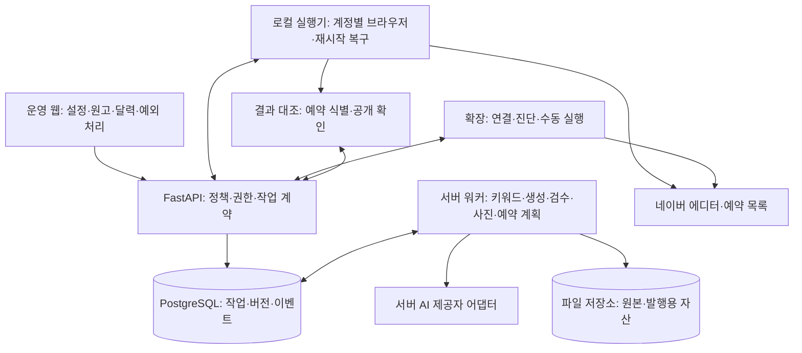
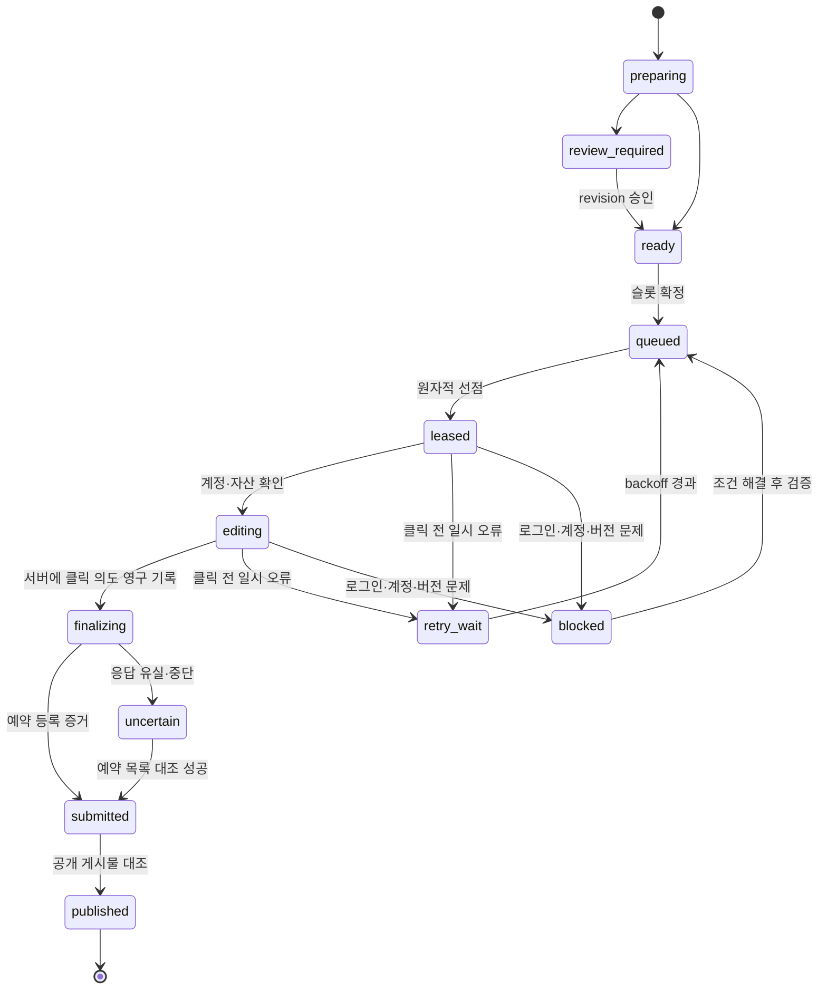

# 블로그 자동화 v2 재설계

작성일: 2026-09-08. 상태: 구현을 위한 설계 기준. 현재 제품이 이 구조로 전환되었다는 의미가 아니다.

후속 코드 변경과 검증 결과는 [구현·전환 기록](BLOG_AUTOMATION_IMPLEMENTATION.md)을 따른다. 아래 검증 기록은 최초 설계 작성 시점의 기록이다.

## 목표와 운영 범위

기존 코드의 주 대상인 네이버 블로그를 우선한다. 병원·블로그 연결과 운영 규칙을 한 번 설정하면 키워드 선정 → 원고 생성 → 품질 검사 → 사진 배치 → 예약 등록 → 공개 확인이 서버의 영구 작업으로 이어지도록 한다. 웹 페이지를 닫거나 실행기가 재시작되어도 진행 이력을 복원하고, 결과를 알 수 없는 발행을 중복 실행하지 않는다.

자동 모드와 승인 모드를 정책으로 지원한다. 자동 모드는 설정된 검수 규칙을 통과한 원고만 진행하고, 승인 모드는 특정 원고 revision에 대한 승인을 기다린다. 초기 전환은 시험 실행을 기본으로 두고 검증된 블로그만 자동 모드를 활성화한다. 실서비스에 이 모드를 켜거나 실제 게시물을 발행한 상태는 아니다.

네이버 로그인/캡차, 에디터 변경, 기기 종료는 외부 조건이다. 로그인 확인이 필요하면 해당 계정만 멈추고 원인을 표시한다. 사용자 PC가 꺼져도 새 예약 등록을 계속하려면 별도 상시 실행 기기가 필요하다. 이미 네이버에 등록된 예약과 서버에서 실행을 기다리는 예약을 화면에서 구분한다. 검색 노출이나 상위 순위를 발행 성공 조건으로 삼지 않는다.

## 전체 구조



서버 DB를 작업 상태의 기준으로 한다. 큐 전달은 중복될 수 있다고 가정하고 결과 적용을 멱등하게 만든다. 브라우저의 외부 발행과 DB 트랜잭션을 원자적으로 묶을 수 없으므로 정확히 한 번 실행을 보장한다고 표현하지 않는다. 최종 클릭 전후의 영구 기록과 예약 목록 대조로 중복 위험을 제어한다.

| 구성 | 담당 | 구현 결정 |
|---|---|---|
| 웹 | 설정, 미리보기, 진행 조회, 예외 해결 | 실행 payload/결과 중계 제거. API 상태 조회 및 이벤트 구독 |
| API | 사용자·블로그 권한, 원고 버전, 작업 선점·전이 | 상태 변경은 단일 서비스에서 처리 |
| 서버 워커 | 키워드/생성/검수/이미지/슬롯 계획 | 기존 기능 재사용, 단계별 입력/출력 저장 |
| 로컬 에이전트 | 지속 실행, 계정별 브라우저, 예약 등록 | 네이버 자동화의 기본 실행기. 기존 Playwright 코드 발전 |
| 확장 | 연결 확인, 에디터 진단, 사용자가 시작한 단건 실행 | 에이전트와 동일한 작업 API. 동일 작업을 동시에 실행하지 않음 |
| PostgreSQL | 작업/이벤트/lease/예약 슬롯 | 운영 기준. SQLite는 단일 실행기 개발 모드로 제한 |
| 미디어 저장소 | 이미지 bytes 및 immutable 자산 | 운영은 공유 가능한 객체 저장소, 로컬은 디렉터리 어댑터 |

처음부터 마이크로서비스를 늘리지 않는다. FastAPI 코드베이스와 별도 워커 프로세스를 유지하고 명확한 모듈 경계부터 만든다. Redis는 캐시·알림 가속에 사용할 수 있으나 작업 완료의 유일한 기록으로 쓰지 않는다.

## 제품 화면과 사용 흐름

1. **연결 설정**: 병원, 블로그, 실행 기기, 실제 로그인 계정, 카테고리, 세션 확인 시각을 표시한다. 웹 로그인과 에이전트 브라우저 로그인은 별개 프로필임을 명시한다.
2. **운영 규칙**: 주제·지역·독자·톤·사용 가능 사진·하루 수량·시간대·최소 간격·예산·승인 정책을 저장한다.
3. **원고함**: 원고 revision, 출처, 검사 결과, 이미지 미리보기, 예상 발행 시각. 수정하면 이전 승인과 발행 준비를 무효화한다.
4. **발행 달력**: 준비 중 / 기기 대기 / 작성 중 / 네이버 예약 등록 / 공개 확인을 별도 표시한다.
5. **문제 해결함**: 로그인 필요, 이미지 실패, 결과 대조 필요, 일정 경과 등 원인과 다음 행동을 표시한다. 결과 대조가 필요한 건에 일반 재시도 버튼을 제공하지 않는다.

기존 one-stop, campaign, saved, bulk는 동일 데이터/API를 사용하는 진입 화면으로 통합한다. 기존 기능에서 만들었던 원고는 출처를 유지한 채 새 원고함으로 가져온다. 사용자는 브라우저 콘솔이나 서버 로그 없이 어느 단계가 왜 멈췄는지 알 수 있어야 한다.

## 데이터와 불변 조건

| 엔터티 | 주요 필드/제약 |
|---|---|
| BlogAccount | tenant_id, platform, external_blog_id, status, category_cache, verified_at. tenant/platform/blog 유일성 |
| AutomationPolicy | blog_account_id, timezone, daily_limit, min_gap, publish_window, review_mode, budget_limit, enabled |
| ContentRevision | content_id, revision, title, ordered_blocks, source_refs, prompt_version, model, input_hash, quality_report. 생성 후 불변 |
| Asset | tenant_id, object_key, sha256, mime, byte_size, width, height, source, usage_rights, status |
| PublishJobV2 | tenant_id, blog_account_id, content_revision_id, payload_hash, mode, scheduled_at_utc, timezone, state, version, next_attempt_at |
| PublishAttempt | job_id, attempt_id, executor_id, fencing_token, lease_until, stage, finalize_intent_at, finished_at, error_code |
| PublishEvent | event_id, job_id, attempt_id, seq, type, timestamp, sanitized_evidence. event_id 유일성 |
| PublishReceipt | job_id, external_post_id 또는 예약 식별자, observed_blog_id, scheduled_at, receipt_type, evidence_ref, verified_at |
| Executor | tenant_id, device_id, kind, version, capabilities, last_seen_at, revoked_at |
| ScheduleSlot | blog_account_id, scheduled_at_utc, job_id, active. 활성 슬롯에 DB 유일 제약 |

공통 불변 조건:

- 모든 조회/변경/사진 다운로드에 tenant와 블로그 소유권을 적용한다.
- 하나의 작업에는 하나의 활성 attempt만, 하나의 브라우저 프로필에는 하나의 활성 편집 작업만 허용한다.
- 발행 payload는 승인된 revision과 이미지 checksum으로 고정한다. 웹 수정으로 실행 중 payload가 바뀌지 않는다.
- idempotency key는 사용자 의도를 식별한다. 같은 키와 같은 요청이면 원래 작업 반환, 다른 요청이면 409. 내용 hash만으로 의도적인 별도 발행을 합치지 않는다.
- `submitted`는 네이버 예약 등록 증거, `published`는 공개 게시물 확인 증거가 있어야 한다. 예약 시각이 지났다는 이유만으로 published로 바꾸지 않는다.
- DB의 시간은 UTC aware datetime. 표시 및 네이버 입력 시 명시적으로 Asia/Seoul로 변환한다. offset을 잘라내지 않는다.
- 예약 분 단위와 최소 여유 시간은 플랫폼 capability로 검증한다. 현재 코드의 10분 슬롯·15분 여유는 실측 전 후보 설정이며 UI에 조정 전후 시각을 보여준다.

## 발행 상태와 장애 복구



| 상황 | 처리 |
|---|---|
| 준비/조회 단계 실패 | 지수 backoff + jitter. 횟수/비용 한도 초과 시 failed |
| lease 만료, 최종 클릭 의도 없음 | 이전 실행기 취소/세대 fencing, 새 attempt로 복구 |
| finalizing 이후 lease 만료 | uncertain. 새 작성 작업을 자동 시작하지 않음 |
| 클릭 후 보고 API 실패 | 로컬 outbox에 결과 저장, 재전송. 최종 클릭을 반복하지 않음 |
| 네이버 목록에서 동일 예약 확인 | 외부 식별자·블로그·시각·원고 특징 대조 후 submitted |
| 목록 조회 실패/비슷한 글만 발견 | uncertain 유지. 제목만으로 동일 발행으로 결론 내리지 않음 |
| 예약 없음이 확인됨 | 대조 시각/범위/증거를 기록하고 명시적 재시도 승인 후 새 attempt |
| 로그인·캡차 | 해당 BlogAccount blocked, 사용자 처리 후 재확인. 다른 블로그 작업은 계속 |
| 예약 시각 경과 | missed_schedule. 즉시 공개로 바꾸지 않음. 정책에 따라 새 슬롯 제안 |
| 사용자 취소 | 클릭 전만 취소 확정. finalizing 이후는 cancel_requested와 대조 절차로 진행 |
| dry-run | 별도 mode/test job. 최종 클릭 불가, production 시도 횟수/슬롯을 소비하지 않음 |

최종 클릭 직전 실행기는 계정 ID, 제목, 필수 이미지, 카테고리, 공개 범위, 예약 값을 다시 읽는다. 실패하면 클릭하지 않는다. 서버가 finalizing을 승인한 뒤 로컬 journal에 클릭 의도를 기록하고 클릭한다. 어느 기록이든 남긴 후 중단되면 보수적으로 결과 대조부터 수행한다.

외부 브라우저 동작을 DB fencing만으로 물리적으로 취소할 수는 없다. 따라서 최종 클릭을 이미 승인한 attempt는 만료되어도 다른 실행기에 발행 권한을 주지 않는다. 모호한 미발행 판단을 자동 재발행의 근거로 사용하지 않는다.

## 실행기 API 계약

기존 `/api/v1/campaign/agent/*`를 내부 변환 어댑터로 전환하고 신규 계약은 `/api/v2/automation`에 둔다. 모든 mutation에는 장치 인증과 권한 검사, 멱등 키가 적용된다.

| API | 요청/응답 및 규칙 |
|---|---|
| POST `/devices/pair` | 짧은 수명의 1회 코드 교환. tenant/device 범위 토큰, 취소/회전 가능 |
| POST `/jobs` | content_revision_id, blog_account_id, mode, scheduled_at, timezone, idempotency_key → job_id |
| POST `/claims` | device_id, blog_account_id, capabilities → 한 번에 1건, attempt_id, fencing_token, lease_until, payload_ref |
| POST `/jobs/{id}/heartbeat` | attempt_id, fencing_token, stage → 연장된 lease. stale/취소/타 기기 409 |
| GET `/jobs/{id}/payload` | 고정 revision, 순서 있는 블록, asset refs, options, payload_hash. 상태 변경 없음 |
| POST `/jobs/{id}/finalize-intent` | attempt와 읽어 확인한 옵션/계정/시각을 검사하고 finalizing 원자 기록 |
| POST `/jobs/{id}/events` | event_id, attempt_id, fencing_token, seq, type, evidence → 중복 event는 원래 ACK |
| POST `/jobs/{id}/reconcile` | 목록 대조 증거 또는 조사 요청. 일반 retry와 분리 |
| POST `/jobs/{id}/cancel` | 현재 단계에 따라 cancelled 또는 cancel_requested |
| GET `/jobs`, GET `/devices` | 웹 UI와 진단용. payload 전달 경로로 사용하지 않음 |

초기 설정값: lease 120초, heartbeat 30초, 1개 프로필 1건. 계정 수를 늘릴 때 기기별 동시 브라우저 상한을 부하 측정으로 결정한다. 긴 이미지 다운로드 중에도 heartbeat는 독립 태스크로 진행한다.

PostgreSQL에서는 짧은 트랜잭션의 행 잠금 또는 조건부 UPDATE로 선점한다. 이미지 생성과 외부 요청을 트랜잭션 안에 넣지 않는다. 큐 소비에서 `SKIP LOCKED`를 사용할 수 있지만 일반 일관성 조회 용도로 사용하지 않는다. [PostgreSQL SELECT 문서](https://www.postgresql.org/docs/current/sql-select.html)

결과 이벤트 처리는 event_id 중복 확인 → 활성 attempt와 token 검사 → 허용 상태 전이 검사 → 영수증/이벤트/상태 같은 트랜잭션 저장 순서다. 최종 상태의 늦은 이벤트는 상태를 되돌리지 않으며 기존 ACK 또는 충돌 사유를 반환한다. 통계/알림/시트 갱신은 outbox로 후속 처리하여 외부 연동 장애가 발행 ACK를 실패시키지 않도록 한다.

## 확장프로그램 재구성

현재 `background.js`의 배치 생성·발행·계정 저장·업데이트·CDP 제어를 다음 경계로 나눈다.

```text
chrome-extension/
  background.js              이벤트 등록·복구 진입점
  core/protocol.js           버전·입출력 검증·오류 코드
  core/state-store.js        작업 checkpoint와 결과 outbox
  core/server-client.js      장치 인증·heartbeat·이벤트 전송
  core/sender-policy.js      origin·tab·frame·action 검사
  adapters/naver/editor.js   문서 준비·본문·이미지·옵션·관측
  adapters/naver/selectors.js
  diagnostics/              민감정보 제거·로그 내보내기
  popup/                    연결/현재 작업/문제 해결
```

허용 웹 origin은 운영 도메인으로 제한한다. 개발 localhost는 개발 manifest에서만 허용한다. 외부 페이지는 연결/조회/서버 작업 ID 전달까지만 가능하며 비밀번호 조회, 임의 URL fetch, 임의 CDP 명령을 실행할 수 없다. 내부 메시지도 sender.id, URL, tabId, frameId와 job/attempt를 확인한다.

`EDITOR_READY`를 작업 시작 권한으로 취급하지 않는다. 단일 소유권을 확보한 tab/frame에서만 실행한다. Service worker 시작, Chrome 시작, 알람에서 journal을 복원하고 서버와 조정한다. 메모리 타이머와 resolver는 영구 상태의 대체재가 아니다. [Chrome 수명 문서](https://developer.chrome.com/docs/extensions/develop/concepts/service-workers/lifecycle)

확장에는 API 비밀키나 네이버 비밀번호를 기본 저장하지 않는다. 사용자 네이버 세션은 해당 브라우저 프로필에 둔다. 로컬 에이전트는 별도 프로필에 최초 로그인해야 하며 확장 세션이 자동 공유된다고 표시하지 않는다. 설치형 에이전트 인증 정보는 OS 자격증명 저장소를 사용한다.

이미지는 URL/asset_id로 전달하고 bytes를 필요할 때 받아 검증한다. 프레임 메시지로 대형 base64 배치를 전송하지 않는다. 웹 페이지 DOM 이벤트가 작업 결과의 유일한 전달 통로가 되지 않도록 확장이 API에 직접 보고한다.

최소 권한과 신뢰 경계는 Chrome의 메시지 보안 지침에 맞춘다. [메시지 전달 문서](https://developer.chrome.com/docs/extensions/develop/concepts/messaging)

## 로컬 발행 에이전트

기존 `agent.py`/`naver_editor.py`의 편집기 기능을 유지하고 runner, journal, server client, adapter로 분리한다. journal은 SQLite로 job/attempt/checkpoint/outbox를 트랜잭션 저장한다. 에이전트 재시작 시 미확인 outbox 전송과 uncertain 조회를 새 claim보다 먼저 수행한다.

블로그별 프로필 잠금은 OS 프로세스 간 잠금으로 구현한다. 같은 디렉터리를 두 프로세스가 열지 못하게 하고, 서버의 device/blog lease와 함께 확인한다. 프로필 경로는 외부 입력 blog_id를 직접 연결하지 않고 내부 UUID로 매핑한다.

편집기 어댑터는 `inspect_session`, `open_editor`, `apply_document`, `verify_document`, `configure_publication`, `verify_options`, `submit_once`, `inspect_receipt`, `find_scheduled_post` 인터페이스를 갖는다. 동작과 관측을 나누고 성공은 관측 결과로 결정한다. 고정 sleep 위주 코드를 조건 기반 대기로 바꾸되 각 단계에는 상한 시간을 둔다.

일반 웹 페이지를 브라우저 자동화로 조작하는 생성 기능은 선택적 수동 보조 모드로 둔다. 무인 생성의 기본은 서버 제공자 API이다. 제공자별 비용/권한은 설정에서 확인하며 무료 무제한 생성을 전제하지 않는다.

## 원고·사진·예약 파이프라인

| 단계 | 영구 결과 | 실패 처리 |
|---|---|---|
| 키워드 수집 | 정규화 키워드, 원천, 수집 시각, 중복 키 | 외부 검색 장애와 결과 0건 구분 |
| 기획 | 브리프 revision, 독자/목적/핵심 사실, 근거 목록 | 필수 정보 부족 시 review_required |
| 생성 | 구조화 문서, 모델/프롬프트 버전, 사용량 | schema 검증, 제한된 재생성, 예산 상한 |
| 검사 | 길이/금칙어/중복/근거 누락/필수 사실 결과 | 실패 사유 저장, 수정해도 새 revision |
| 사진 배정 | 블록별 asset_id, 출처/사용권, caption/alt | 필수 사진 누락이면 ready 불가 |
| 렌더링 | 고정 title/blocks/options/asset checksum | 업로드 전 MIME·용량·크기 검사 |
| 슬롯 배정 | timezone 명시 예약과 예약 점유 레코드 | DB 충돌 시 재계산, 같은 작업 중복 생성 방지 |
| 등록/대조 | attempt와 receipt | 실패 단계에 따라 재시도 또는 uncertain |
| 공개 확인 | 외부 게시물 ID/URL, 확인 시각 | 조회 오류는 확인 지연. 새 발행을 만들지 않음 |

현재 정적 검사나 LLM 검사 통과를 의료 표현의 적법성 보증으로 표시하지 않는다. 병원 제공 사실과 출처가 없는 효능/수치 주장은 검토 대상으로 기록한다. 이미지 변형은 편집 기능이며 저작권 확보나 검색 노출 보장으로 표시하지 않는다.

사진 원본과 변형을 불변 자산으로 관리하고 재시도 시 동일 자산을 재사용한다. usage count는 선점 횟수가 아니라 실제 사용 영수증으로 반영한다. 발행 데이터는 객체 저장소에 보관하고 API/워커 인스턴스의 로컬 디스크 경로를 서로 공유한다고 가정하지 않는다.

## 운영과 배포

- API 프로세스에서 장기 워커와 스키마 변경을 분리한다. Alembic으로 선행 migration, API는 schema revision을 검사한다.
- 배포 파이프라인: 계약 검사 → 단위/DB 동시성 테스트 → 가짜 에디터 E2E → 빌드 → 버전 호환성 검사 → 제한된 배포.
- 확장 source/ZIP/CRX/version.json/updates.xml을 단일 버전 값에서 생성하고 checksum을 대조한다. 수동 압축본을 별도 진실 원천으로 두지 않는다.
- 신규 서버는 이전 계약을 지원하는 동안만 구 확장을 허용한다. min protocol/capability 미달이면 새 작업 선점 차단, 진행 중 결과 수집은 유지한다.
- 기기 offline, heartbeat 지연, 원고 실패율, uncertain 건수, 예약 지연, 결과 ACK 지연, 비용/글, 이미지 실패율을 계측한다.
- 로그 공통 필드는 job_id/attempt_id/device_id/stage/duration/error_code. 비밀번호, 쿠키, 토큰, 전체 원고와 이미지 bytes를 로그에 남기지 않는다.
- 기본 보존 제안: 진단 14일, 민감정보 제거한 실패 증거 7일, 작업 이벤트 90일. 정책 설정과 삭제 작업으로 관리한다.
- DB 및 미디어 백업 복구를 실제 시험한다. 운영 비밀값은 배포 설정에서 주입하고 개발 compose와 분리한다.

## 기존 코드 전환 순서와 완료 기준

| 단계 | 변경 대상 | 완료 조건 |
|---|---|---|
| 0. 기준선 | 현재 경로 inventory, 테스트, 진단 | 이번 점검 문서와 오류 재현 목록. 기존 데이터 삭제 없음 |
| 1. 발행 계약 | 새 job/attempt/event/receipt 모델, migration, API | 동시 20개 claim 중 한 작업당 1개만 성공, 무토큰/구토큰 거절, 중복 결과 멱등 |
| 2. 실행기 복구 | agent journal/outbox/heartbeat/finalize-intent | 단계별 프로세스 강제 종료 후 회복. 클릭 후 중단은 재클릭 없음 |
| 3. 확장 정리 | origin 제한, 프레임 소유권, 직접 API 보고 | 워커 재시작·탭 종료·잘못된 origin 테스트 통과 |
| 4. 생성 통합 | 원고 revision, 서버 생성, 자산 저장 | 웹 종료 후 생성 지속, 재시도 중복 원고 없음, 예산 상한 준수 |
| 5. 제품 통합 | 원고함/달력/예외함과 구 진입 화면 | 새로고침/다른 기기에서도 같은 상태, 등록/공개 구분 |
| 6. 데이터 이전 | legacy 모델과 v2 매핑 | 행 수/소유권/원고 hash/예약 시각 대조, ambiguous legacy는 uncertain |
| 7. 운영 검증 | 시험 계정 및 제한 블로그 운영 | 아래 수용 테스트와 실세션 검증 결과 기록 |

이전 테이블은 additive migration으로 유지한다. `(legacy_source, legacy_id)` 매핑을 유일하게 두고 반복 이관해도 중복 생성하지 않는다. 출처별 naive timestamp의 실제 의미를 확인한 뒤 변환하고 불분명한 시각은 수동 검토로 둔다. `registered`/`published` 문자열만 보고 새 published로 이관하지 않는다.

tenant별 feature flag로 새 경로를 전환한다. 전환 중 같은 블로그에 구/신 실행기를 동시에 활성화하지 않는다. 진행 작업과 영수증을 대조한 뒤 구 큐를 읽기 전용으로 만든다. 롤백은 새 claim 중지와 결과 수집 유지로 시작하고 외부 등록 작업을 구 큐에 재복제하지 않는다.

예상 파일 경계는 `backend/app/automation/{models,schemas,service,claims,reconciliation}.py`, `backend/app/api/automation.py`, `publish-agent/{runner,journal,outbox}.py`, 확장 core/adapters, 프론트 automation API/hooks이다. 이름은 구현 시 저장소 규칙에 맞출 수 있으나 작업 전이 책임은 한곳에 둔다.

## 수용 테스트

아래 수치는 출시 판정을 위한 제안 기준이며 달성 측정값이 아니다.

| 시나리오 | 합격 기준 |
|---|---|
| 100건 가짜 에디터 배치, 2개 실행기 | 작업/최종 클릭 중복 0, 모든 작업에 추적 가능한 최종/보류 상태 |
| 모든 단계 강제 종료 | 클릭 전 재개 가능, 클릭 의도 이후 uncertain 대조, 조용한 작업 유실 0 |
| 동일 결과 10회 전송 | 시도 횟수·통계·영수증 한 번만 반영 |
| ACK 직전 서버 장애 | outbox 복구 후 결과 반영, 네이버 재클릭 0 |
| 만료된 실행기 보고 | 다른 attempt/완료 작업 상태 덮어쓰기 0 |
| 웹 새로고침/닫기 | 실행과 결과 보고 지속, 다시 열면 서버 상태 복원 |
| 계정 ID 없음/불일치 | 제목 입력·최종 클릭 0 |
| 필수 이미지/카테고리/예약 읽기 실패 | 최종 클릭 0, 구체적인 원인 표시 |
| KST 외 시간대, 자정, 임박한 예약 | 동일 UTC 순간 유지, 조용한 즉시 공개 0 |
| 악성 origin/타 tenant/잘못된 frame | 명령/자산 접근 거절 |
| dry-run 후 일반 실행기 재기동 | dry-run 자동 실발행 0 |
| 블로그 로그인 만료 | 해당 블로그만 보류, 다른 블로그 진행 |
| 실제 네이버 시험 | 제목·본문·이미지·예약·계정 실측, 예약 목록과 공개 URL 대조 기록 |

가짜 DOM 테스트는 네이버 실제 UI 지원을 증명하지 않는다. 실세션에서는 먼저 최종 클릭 없는 검증을 수행하고, 실제 발행 검증은 지정된 시험 블로그/원고/시간에 대해 별도로 실행한다. 외부 플랫폼 변경을 완전히 통제할 수 없으므로 고정 성공률을 약속하지 않는다.

## 검증 기록

- 이번 코드 변경: 로컬 발행 실행기의 계정 확인 실패 중단과 클릭 후 불확실성 분류 보강.
- 추가 회귀 테스트: 계정 ID 누락, 최종 응답 없음, 클릭 후 타입별 예외, 성공 플래그와 uncertain이 함께 올 때 uncertain 우선.
- 오프라인 테스트: `cd publish-agent` → `python test_dryrun_offline.py` — **40개 통과** (최종 변경 후 실행). 대역 편집기와 로컬 가짜 서버를 사용한 결과다.
- 변경 공백 검사: `git diff --check` 통과.
- 실제 네이버 로그인/예약 등록/공개 확인: 수행하지 않음.
- v2 API/DB migration/확장 개편/배포: 이 문서의 후속 구현 범위이며 아직 적용하지 않음.
