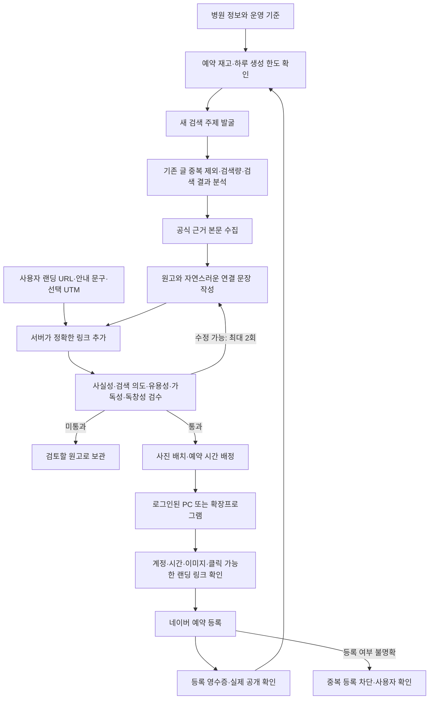

# 블로그 반복 자동 운영과 랜딩페이지 연결

## 구현 범위

캠페인에 병원·진료 항목, 블로그, 사진 세트를 연결하고 운영 기준을 저장하면 키워드 선택 없이 반복 준비한다. 랜딩 URL은 자동 운영을 켜지 않고 별도로 저장할 수도 있다. 이 설정은 캠페인에서 새로 작성하는 선택 키워드 대량 원고에도 적용된다.

## 지속 실행과 예외 처리

- `campaign_autopilot_policies`에 설정, 사용량, 다음 실행 시각, 최근 작업을 저장한다. 시작·일시정지 API와 화면을 추가했다.
- 여러 워커가 동시에 실행해도 정책 행의 조건부 UPDATE, 캠페인 실행 소유권, 작업 생성을 같은 트랜잭션으로 확정한다.
- 하루 생성 한도는 KST 날짜 기준으로 **예약한 원고 시도 수**를 센다. 실패·일시정지·재시작으로 초기화하지 않는다. 금액 상한은 아니며, 한 원고에 작성·검수·최대 두 번 수정, 워커 재시도 비용이 발생할 수 있다.
- 기본값은 하루 발행 목표 2건, 3일치 준비, 하루 새 원고 시도 6건이다. 블로그 자체 일일 한도와 시간 간격도 적용한다. 실제 발행 건수 보장은 아니다.
- 주제 후보와 선정 키워드를 작업에 저장한다. 재시작 시 다른 키워드로 바뀌지 않는다. 병원 내 기존 원고의 동일 정규화 키워드를 제외하고 최근 300개 본문과 유사도를 확인한다.
- 검색량 API가 없으면 병원 진료 항목에서 만든 편집 주제를 사용할 수 있지만 검색량은 미확인으로 기록한다. 검색 순위·수요를 만들어 표시하지 않는다.
- 검수 실패 원고를 보관하고 통과 원고만 예약한다. 근거 수집 실패도 자동 승인하지 않는다.
- 발행 오류·등록 여부 불명확 상태에서는 새 원고 보충을 대기한다. 이미 작성해 둔 글을 무조건 재발행하지 않는다.
- 한 번도 실행기를 배정하지 않은 예약 대기 건이 시간을 놓친 경우, 검수 승인된 글에 한해 새 시간을 배정한다. 발행 시도·불확실 결과가 있는 글은 이동하지 않는다.
- 유지보수 루프를 원고 생성 루프와 분리했다. 긴 모델 호출 중에는 별도 DB 세션으로 워커 생존 상태를 갱신한다.
- 일시정지는 새 작업·새 실행기 배정을 멈춘다. 네이버에 이미 등록한 예약을 취소하지 않으며 최종 등록 중인 작업은 완료될 수 있다.

## 품질 기준과 근거

네이버 웹문서 검색 API로 허용된 공공 의료정보 발행처의 문서를 찾는다. 현재 허용 목록은 질병관리청, NHS, MedlinePlus, 미국 국립암연구소 도메인이다. 응답 본문 크기, URL, 리디렉션 목적지, HTML 여부를 검사한다. 검색 발췌만으로 작성하지 않고 실제 본문을 확보한다.

작성 모델과 별도의 검수 호출에서 근거 관련성, 근거 밖 주장, 창작된 환자 경험, 검색 의도, 유용성, 가독성, 독창성을 확인한다. 점수는 각 항목 기본 85점 이상이며 사실성 조건이나 필수 검사에 실패하면 평균 점수가 높아도 승인하지 않는다. Pydantic 응답 검증 실패도 승인하지 않는다. 분량·문단 반복·금칙어·기존 글 유사도는 별도로 검사한다.

원고별 근거 URL·수집 시각·본문 해시, 수정 전 원고와 검수 이력, 승인된 최종 원고 해시를 저장한다. 원고함에서 점수·근거·수정 횟수를 확인할 수 있다. 수정한 원고의 해시가 달라지면 이전 자동 승인을 재사용할 수 없다. 이는 자동 편집 검수이며 의학적 사실이나 법적 적합성에 대한 전문가 보증이 아니다.

## 랜딩페이지 유입

설정 항목:

| 항목 | 동작 |
| --- | --- |
| 랜딩 URL | HTTPS 주소를 입력한다. 사용자 정보 포함 주소, 공백·제어 문자·스크립트 주소를 거부한다. |
| 페이지 목적 | 예: 진료 과정과 예약 방법 안내. 이 범위 밖 혜택·치료효과를 지어내지 않도록 작성한다. |
| 링크 안내 문구 | 기본 ‘자세한 안내 확인하기’. |
| 글별 UTM | 선택 기능. 기본 꺼짐. 켜면 네이버/블로그/캠페인 ID/원고 ID를 추가한다. 기존 쿼리·UTM·fragment는 유지한다. |

모델은 글의 질문과 랜딩 목적을 잇는 1~2문장만 생성한다. 서버가 원고 끝에 연결 문장, 안내 문구, 정확한 URL을 한 번 붙인다. 추적값을 켜지 않으면 입력 URL을 그대로 유지한다. 본문 안에 모델이 임의 URL을 넣으면 검수 실패로 처리한다. 자동 운영의 설정은 각 작업에 복사하므로 진행 중인 묶음의 목적지가 바뀌지 않는다.

예시 구조(실제 연결 문장은 글마다 작성):

> 진료 과정을 더 알아보고 싶다면 아래 안내에서 필요한 내용을 확인할 수 있습니다.
>
> 자세한 안내 확인하기
>
> https://example.com/guide?utm_source=naver&utm_medium=blog&utm_campaign=캠페인ID&utm_content=원고ID

URL 입력 중 키워드 강조 때문에 주소가 쪼개지지 않도록 실행기와 확장프로그램을 수정했다. 발행 전 본문 내 실제 `a[href]`가 해당 URL과 일치하는지 확인한다. 단순히 주소 글자가 있다는 이유로 성공 처리하지 않는다. 최신 실행기가 `landing_links_v1` 기능을 선언해야 해당 글을 가져갈 수 있다.

UTM은 랜딩페이지에 설치된 방문 분석 도구에서 글별 유입을 구분하는 용도다. 이 프로젝트에 클릭 수집 서버나 상담·예약 전환 집계를 새로 구현한 것은 아니다. 랜딩페이지를 자동 제작하거나 그 내용을 검증하는 기능도 포함하지 않는다.

## Windows 실행기와 확장프로그램

`publish-agent/dist/DoctorVoiceAutopilotSetup.exe`를 두 번 클릭해 설치한다(2026-09-10부터 ZIP 배포를 대체). 관리자 권한 없이 `%LOCALAPPDATA%\DoctorVoiceAutopilot`에 설치하고, 실행기가 켜질 때 `launcher-version.json`으로 새 버전을 스스로 확인한다. Python 별도 설치 없이 실행하도록 패키징했으며, Chrome이 설치된 PC가 필요하다. 코드 서명 인증서가 없어 SmartScreen 경고는 남아 있다.

앱에서 닥터보이스 계정으로 로그인하고 ‘자동 발행 시작’을 누른다. 브라우저의 네이버 로그인·캡차 요청은 직접 처리한다. 앱 비밀번호는 메모리에서만 사용하며 설정 파일에는 서버 주소와 이메일만 저장한다. 실행 기록과 브라우저 프로필은 사용자 LocalAppData의 DoctorVoicePro 폴더에 저장한다. 중단 요청은 진행 중인 결과를 보존한 뒤 종료한다. PC가 꺼지면 새 예약 등록은 멈춘다.

**2026-09-10부터 크롬 확장은 쓰지 않는다** — 발행·카테고리·원고 생성이 모두 서버와 PC 실행기로 넘어갔다. [확장 폐기 기록](EXTENSION_RETIREMENT_2026-09-10.md) 참고. 아래는 그 전의 확장 배포 기록이다. 확장프로그램은 `frontend/public/extension/doctorvoice-extension-v17.1.0.zip`이다. 서버 작업이 기본 임시저장 동작으로 내려가던 연결 오류를 수정해 예약 동작을 명시했다. 랜딩 링크 검사도 같은 버전에 포함한다. 기존 CRX 서명·자동 업데이트 XML은 별도 운영 배포가 필요하다.

웹 검증도 완료했다. TypeScript 검사와 Next.js 프로덕션 빌드가 통과했고 50개 페이지가 생성됐다. 기존 `/payment/billing-setup` 페이지의 클라이언트 렌더링 경고는 남아 있다.

## 적용과 확인

1. 백엔드·프론트엔드·실행기를 함께 업데이트한다. 운영 DB는 백업 및 기존 Alembic 버전 상태를 확인한 뒤 추가 마이그레이션 `20260908_autopilot`을 적용한다. 이 작업에서는 운영 DB를 변경하지 않았다.
2. Claude API, 네이버 검색 API를 설정한다. 검색광고 API는 검색량 측정에 추가로 사용한다.
3. 캠페인의 병원 정보, 블로그, 사진 세트, 랜딩 목적지를 저장한다.
4. 원고 품질과 실제 네이버 예약 등록·클릭 링크·공개 결과를 계정 환경에서 검증한다.

검증: 백엔드 43개, 실행기·저널·데스크톱 순수 로직 48개, 확장프로그램 결과 복구 5개. 브라우저 테스트는 기존 9개와 신규 실제 링크 요소 대조 1개를 검증한다. Windows 패키지 자체 점검에서 Tcl 8.6.15 및 편집기·저널 모듈 로딩을 확인했다. 외부 모델·검색 응답은 테스트 대역이며 실제 AI 글의 품질 검증과 네이버 실계정 발행을 대신하지 않는다.

남은 운영 검증: 실제 네이버의 URL 자동 링크 변환, 예약 목록 영수증, 공개 확인, 로그인 유지, 대량 운영 시간·비용, PostgreSQL 동시성, 운영 배포. 주소가 자동 링크로 변환되지 않는 편집기 환경은 현재 발행을 보류한다. 예약 등록 후 URL을 얻지 못한 결과는 여전히 확인이 필요하며 예약 목록에서 자동으로 찾아 대조하는 기능은 미구현이다. 따라서 ‘모든 상황에서 완벽한 무인 발행’으로 표시하지 않는다.

공식 자료: [네이버 웹문서 검색 API](https://developers.naver.com/docs/serviceapi/search/web/web.md), [네이버 오픈 API 목록](https://developers.naver.com/products/intro/plan/plan.md), [Claude 모델 식별자 조회](https://platform.claude.com/docs/en/api/models/retrieve). 모델·검색 API 사용 범위 확인에 사용했으며 실제 연결 성공을 의미하지 않는다.
